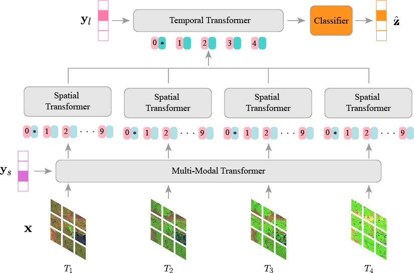
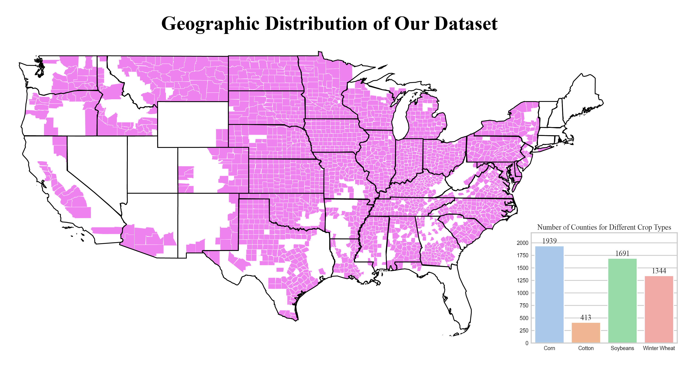
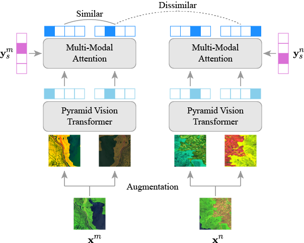

# MMST-ViT: Climate Change-aware Crop Yield Prediction via Multi-Modal Spatial-Temporal Vision Transformer

## Model Overview




This repository provides the official implementation of our proposed Multi-Modal Spatial-Temporal Vision Transformer (MMST-ViT), developed for predicting crop yields at the county level across the United States. It consists of a Multi-Modal Transformer, a Spatial Transformer, and a Temporal Transformer. The Multi-Modal Transformer leverages satellite images and meteorological data during the growing season to capture the direct impact of short-term weather variations on crop growth. The Spatial Transformer learns the high-resolution spatial dependency among counties for precise crop tracking. The Temporal Transformer captures the effects of long-term climate change on crops.

## Datasets

### The Tiny CropNet Dataset

This paper utilizes the ***Tiny CropNet*** dataset for accurate county-level crop yield predictions. Specifically, the Tiny CropNet dataset is composed of three modalities, i.e., Sentinel-2 Imagery, WRF-HRRR Computed Dataset, and USDA Crop Dataset,
with their details outlined below:

- **Sentinel-2 Imagery**: The dataset is a set of 384x384 RGB images captured by the Sentinel-2 Earth observation satellite. It provides agriculture imagery for the contiguous U.S. continent from 2017 to 2022 with a 2-week interval. Since precise agricultural tracking requires high-resolution remote sensing data, the image of a county is partitioned into multiple fine-grained grids (9×9 km).

- **WRF-HRRR Computed Dataset**: The dataset, obtained from the Weather Research & Forecasting-based High-Resolution Rapid Refresh Model (WRF-HRRR), provides high-resolution meteorological data for the contiguous U.S. continent. It covers 9 weather parameters from 2017 to 2022.

- **USDA Crop Dataset**: The dataset, sourced from the United States Department of Agriculture (USDA), provides annual crop data for major crops grown in the United States (U.S.), including corn, cotton, soybean, winter wheat, etc., on a county-level basis. It covers crop information such as production and yield from 2017 to 2022.

Now, our Tiny CropNet dataset is available at [HuggingFace Datasets](https://huggingface.co/datasets/fudong03/Tiny-CropNet/tree/main).


### The CropNet Dataset
**As of March 2024, we are releasing our CropNet dataset at [HuggingFace Datasets](https://huggingface.co/datasets/CropNet/CropNet), with its tutorials available at [Github](https://github.com/fudonglin/CropNet)**. The CropNet dataset is an extension of the Tiny CropNet Dataset. It is composed of three modalities of data, i.e., Sentinel-2 Imagery, WRF-HRRR Computed Dataset, and USDA Crop Dataset, spanning from 2017 to 2022 (i.e., 6 years) across 2291 (over 3143 in total) U.S. counties, with its geographic distribution illustrated below. We also include the number of counties corresponding to each crop type in the USDA Crop Dataset (see the rightmost bar chart in the figure) since crop planting is highly geography-dependent.



## Requirements

Our model is based on the following libraries:

- torch == 1.13.0
- torchvision == 0.14.0
- timm == 0.5.4
- numpy == 1.24.4
- pandas == 2.0.3
- h5py == 3.9.0
- einops == 0.6.1
- Pillow == 10.0.0
- argparse == 1.4.0
- tqdm == 4.65.0
- scikit-learn == 1.3.0
- tensorboard == 2.13.0

You can use the following instructions to install all the requirements:

```python
# install requirements
pip install -r requirements.txt
```

The following code shows how to generate the JSON configuration file for the data loader (using soybean predictions as an example):
```python
python config/build_config_soybean.py
```


## Pre-training




The above figure illustrates the architecture of our proposed multi-modal self-supervised pre-training.

 To pre-train MMST-ViT, please run the following command:

```python
# pre-train
python main_pretrain_mmst_vit.py
```


## Fine-tuning

To fine-tune MMST-ViT for crop yield predictions, use the following command:

```python
# fine-tune
python main_finetune_mmst_vit.py
```

## License

This repository is under the CC-BY-NC 4.0 license. Please refer to [LICENSE](https://github.com/fudong03/MMST-ViT/blob/main/LICENSE) for details.

## Acknowledgment

This repository is based on the official implementation of [PVT](https://github.com/whai362/PVT) and [MAE](https://github.com/facebookresearch/mae). We thank the authors for releasing the code.

## Citation

```
@inproceedings{fudong:iccv23:mmst_vit,
    author    = {Lin, Fudong and Crawford, Summer and Guillot, Kaleb and Zhang, Yihe and Chen, Yan and Yuan, Xu and Chen, Li and Williams, Shelby and Minvielle, Robert
and Xiao, Xiangming and Gholson, Drew and Ashwell, Nicolas and Setiyono, Tri and Tubana, Brenda and Peng, Lu and Bayoumi, Magdy and Tzeng, Nian-Feng},
    title     = {MMST-ViT: Climate Change-aware Crop Yield Prediction via Multi-Modal Spatial-Temporal Vision Transformer},
    booktitle = {IEEE/CVF International Conference on Computer Vision (ICCV)},
    year      = {2023},
    pages     = {5774-5784}
}
```
